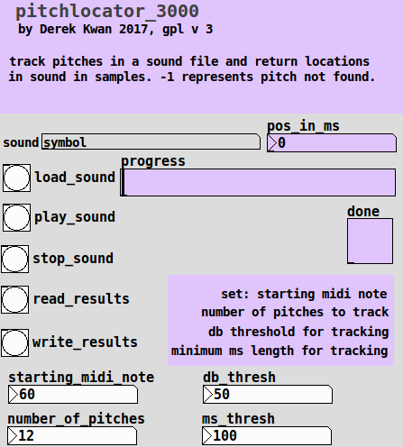

# pitchlocator-3000
pure data patch to locate pitches in a sound file

vanilla (only requires [sigmund~] from vanilla's extras)

- reads through a soundfile and uses sigmund~ to detect pitches in a sound file. it records the location of specified pitches in a text file for use in perhaps a sample chopper (like my nobu~ abstraction in pdkvabs).

